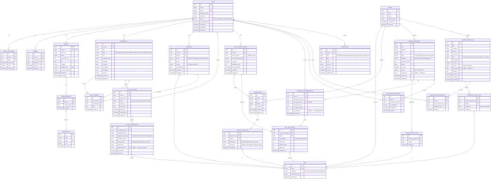

```mermaid
erDiagram

%% =========================================================
%% GROWVIA — ENTITY RELATIONSHIP DIAGRAM
%% =========================================================

%% ─── AUTH & USER ──────────────────────────────────────────

    ADMIN {
        uuid        id              PK
        string      name
        string      email           UK
        string      password_hash
        timestamp   last_login_at
        timestamp   created_at
    }

    USER {
        uuid        id              PK
        string      name
        string      email           UK
        string      password_hash
        string      avatar_url
        enum        status          "active | unverified | suspended | deleted"
        timestamp   email_verified_at
        timestamp   created_at
        timestamp   updated_at
        timestamp   deleted_at
    }

    EMAIL_VERIFICATION {
        uuid        id              PK
        uuid        user_id         FK
        string      token           UK
        timestamp   expires_at
        boolean     used
        timestamp   created_at
    }

    SESSION {
        uuid        id              PK
        uuid        user_id         FK
        string      refresh_token   UK
        string      device_info
        timestamp   expires_at
        timestamp   created_at
    }

%% ─── PROFILE ──────────────────────────────────────────────

    PROFILE {
        uuid        id              PK
        uuid        user_id         FK  "1-to-1"
        string      institution
        string      major
        int         graduation_year
        text        bio
        string      headline
        string      portfolio_slug  UK
        boolean     portfolio_published
        timestamp   created_at
        timestamp   updated_at
    }

    CAREER_INTEREST {
        uuid        id              PK
        uuid        profile_id      FK
        uuid        career_field_id FK
        timestamp   created_at
    }

    CAREER_FIELD {
        uuid        id              PK
        string      name
        string      slug            UK
        string      icon
        timestamp   created_at
    }

%% ─── EXPERIENCE ───────────────────────────────────────────

    EXPERIENCE {
        uuid        id              PK
        uuid        user_id         FK
        string      title
        enum        type            "organisation | committee | internship | freelance | project | competition | other"
        string      role
        string      institution_name
        date        start_date
        date        end_date
        boolean     is_ongoing
        text        description
        string      proof_url
        timestamp   created_at
        timestamp   updated_at
    }

%% ─── SKILL ────────────────────────────────────────────────

    SKILL {
        uuid        id              PK
        string      name            UK
        enum        category        "hard_skill | soft_skill | technical | leadership"
        string      normalized_name
        timestamp   created_at
    }

    USER_SKILL {
        uuid        id              PK
        uuid        user_id         FK
        uuid        skill_id        FK
        enum        level           "beginner | intermediate | advanced | expert"
        int         score
        enum        source          "ai_extracted | manual"
        float       ai_confidence
        timestamp   created_at
        timestamp   updated_at
    }

    SKILL_EVIDENCE {
        uuid        id              PK
        uuid        user_skill_id   FK
        uuid        experience_id   FK
        text        note
        timestamp   created_at
    }

%% ─── AI ANALYSIS ──────────────────────────────────────────

    AI_ANALYSIS_JOB {
        uuid        id              PK
        uuid        user_id         FK
        uuid        experience_id   FK
        enum        status          "queued | processing | completed | failed"
        text        raw_input
        json        raw_output
        timestamp   started_at
        timestamp   completed_at
        timestamp   created_at
    }

    AI_SKILL_SUGGESTION {
        uuid        id                  PK
        uuid        ai_analysis_job_id  FK
        string      suggested_name
        enum        suggested_category  "hard_skill | soft_skill | technical | leadership"
        float       confidence_score
        enum        review_status       "pending | accepted | edited | rejected"
        string      final_name
        uuid        mapped_skill_id     FK  "nullable — set after accepted"
        timestamp   reviewed_at
        timestamp   created_at
    }

%% ─── CAREER TARGET ────────────────────────────────────────

    CAREER_ROLE {
        uuid        id              PK
        string      name
        string      slug            UK
        string      industry
        text        description
        timestamp   created_at
        timestamp   updated_at
    }

    CAREER_ROLE_SKILL {
        uuid        id              PK
        uuid        career_role_id  FK
        uuid        skill_id        FK
        enum        importance      "required | important | nice_to_have"
        enum        min_level       "beginner | intermediate | advanced | expert"
        timestamp   created_at
    }

    USER_CAREER_TARGET {
        uuid        id              PK
        uuid        user_id         FK
        uuid        career_role_id  FK  "nullable if custom"
        string      custom_career_name
        boolean     is_active
        int         readiness_score
        timestamp   last_analyzed_at
        timestamp   created_at
        timestamp   updated_at
    }

%% ─── SKILL GAP ────────────────────────────────────────────

    SKILL_GAP_RESULT {
        uuid        id                      PK
        uuid        user_career_target_id   FK
        uuid        skill_id                FK
        enum        gap_category            "strong | develop | missing"
        int         user_score
        int         required_score
        int         gap_score
        timestamp   analyzed_at
    }

%% ─── LEARNING ─────────────────────────────────────────────

    LEARNING_RESOURCE {
        uuid        id              PK
        string      title
        string      platform
        string      url
        enum        type            "course | article | video | bootcamp | book"
        enum        difficulty      "beginner | intermediate | advanced"
        int         duration_minutes
        float       rating
        boolean     is_active
        enum        source          "admin | api_import"
        uuid        created_by      FK  "nullable — ADMIN.id"
        timestamp   created_at
        timestamp   updated_at
    }

    RESOURCE_SKILL_TAG {
        uuid        id                  PK
        uuid        learning_resource_id FK
        uuid        skill_id            FK
        timestamp   created_at
    }

    LEARNING_RECOMMENDATION {
        uuid        id                      PK
        uuid        user_id                 FK
        uuid        learning_resource_id    FK
        uuid        skill_gap_result_id     FK  "nullable"
        float       relevance_score
        int         ai_ranking_position
        text        ai_reasoning            "nullable — reasoning dari LLM"
        timestamp   generated_at
    }

    USER_SAVED_RESOURCE {
        uuid        id                      PK
        uuid        user_id                 FK
        uuid        learning_resource_id    FK
        boolean     is_completed
        timestamp   completed_at
        timestamp   saved_at
    }

%% ─── CAREER OPPORTUNITY ───────────────────────────────────

    CAREER_OPPORTUNITY {
        uuid        id              PK
        string      title
        string      company
        string      location
        string      source_url
        enum        type            "internship | part_time | full_time | freelance | competition"
        text        description
        boolean     is_active
        enum        source          "admin | api_import"
        uuid        created_by      FK  "nullable — ADMIN.id"
        date        deadline
        timestamp   posted_at
        timestamp   created_at
        timestamp   updated_at
    }

    OPPORTUNITY_SKILL_TAG {
        uuid        id                      PK
        uuid        career_opportunity_id   FK
        uuid        skill_id                FK
        enum        importance              "required | preferred"
        timestamp   created_at
    }

    USER_SAVED_OPPORTUNITY {
        uuid        id                      PK
        uuid        user_id                 FK
        uuid        career_opportunity_id   FK
        int         skill_match_score
        timestamp   saved_at
    }

%% ─── NOTIFICATION ─────────────────────────────────────────

    NOTIFICATION {
        uuid        id              PK
        uuid        user_id         FK
        enum        type            "skill_update | learning_reminder | career_opportunity | portfolio_view"
        string      title
        text        body
        string      action_url
        boolean     is_read
        timestamp   read_at
        timestamp   created_at
    }

%% =========================================================
%% RELATIONSHIPS
%% =========================================================

%% ─── ADMIN ────────────────────────────────────────────────

    ADMIN                   ||--o{    SKILL                    : "manages"
    ADMIN                   ||--o{    CAREER_ROLE              : "manages"
    ADMIN                   ||--o{    LEARNING_RESOURCE        : "manages"
    ADMIN                   ||--o{    CAREER_OPPORTUNITY       : "manages"

%% ─── USER ─────────────────────────────────────────────────

    USER                    ||--o{    EMAIL_VERIFICATION       : "has"
    USER                    ||--o{    SESSION                  : "has"
    USER                    ||--|{    PROFILE                  : "has"
    USER                    ||--o{    EXPERIENCE               : "logs"
    USER                    ||--o{    USER_SKILL               : "owns"
    USER                    ||--o{    AI_ANALYSIS_JOB          : "triggers"
    USER                    ||--o{    USER_CAREER_TARGET        : "sets"
    USER                    ||--o{    LEARNING_RECOMMENDATION   : "receives"
    USER                    ||--o{    USER_SAVED_RESOURCE       : "saves"
    USER                    ||--o{    USER_SAVED_OPPORTUNITY    : "saves"
    USER                    ||--o{    NOTIFICATION             : "receives"

    PROFILE                 ||--o{    CAREER_INTEREST          : "has"
    CAREER_INTEREST         }o--||    CAREER_FIELD             : "references"

    EXPERIENCE              ||--o{    SKILL_EVIDENCE           : "proves"
    EXPERIENCE              ||--o{    AI_ANALYSIS_JOB          : "triggers"

    USER_SKILL              }o--||    SKILL                    : "is"
    USER_SKILL              ||--o{    SKILL_EVIDENCE           : "backed by"
    SKILL_EVIDENCE          }o--||    EXPERIENCE               : "from"

    AI_ANALYSIS_JOB         ||--o{    AI_SKILL_SUGGESTION      : "produces"
    AI_SKILL_SUGGESTION     }o--o|    SKILL                    : "maps to"

    CAREER_ROLE             ||--o{    CAREER_ROLE_SKILL        : "requires"
    CAREER_ROLE_SKILL       }o--||    SKILL                    : "is"

    USER_CAREER_TARGET      }o--o|    CAREER_ROLE              : "targets"
    USER_CAREER_TARGET      ||--o{    SKILL_GAP_RESULT         : "produces"
    SKILL_GAP_RESULT        }o--||    SKILL                    : "analyzes"

    LEARNING_RESOURCE       ||--o{    RESOURCE_SKILL_TAG       : "tagged with"
    RESOURCE_SKILL_TAG      }o--||    SKILL                    : "is"
    LEARNING_RESOURCE       ||--o{    LEARNING_RECOMMENDATION  : "in"
    LEARNING_RESOURCE       ||--o{    USER_SAVED_RESOURCE      : "saved as"
    LEARNING_RECOMMENDATION }o--o|    SKILL_GAP_RESULT         : "targets"

    CAREER_OPPORTUNITY      ||--o{    OPPORTUNITY_SKILL_TAG    : "requires"
    OPPORTUNITY_SKILL_TAG   }o--||    SKILL                    : "is"
    CAREER_OPPORTUNITY      ||--o{    USER_SAVED_OPPORTUNITY   : "saved as"
```
